# Частичный клон игры Supaplex

## Правила игры
Игровое поле - прямоугольная сетка.

Каждая клетка может быть пустой, или содержать один из следующих объектов:

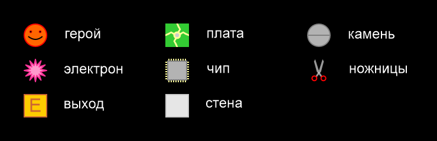

Игрок управляет **героем**, который может стоять на месте или двигаться
в одном из четырёх направлений.

Цель игры - собрать все **электроны** и добраться до **выхода**.

### Движение героя
При движении в любом из четырёх направлений (вверх, вниз, вправо, влево)
**герой** может:
- перейти на пустое место;
- поглотить **плату** или **электрон**;
- толкнуть **камень** если за ним есть пустое место (такое движение медленнее обычного);
- уйти в **выход** если собрал достаточно **электронов** (тогда уровень пройден);
- столкнуться с **ножницами**.

### Движение камней и электронов
**Камни** и **электроны** падают, если под ними есть пустое место.

Если клетки справа от **камня** (**электрона**) и справа внизу пусты,
и он лежит на круглом объекте, то **камень** (**электрон**) скатывается вправо.
То есть перемещается вправо, а затем падает вниз.

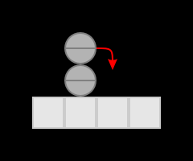

То же самое (но во вторую очередь) для направления влево.

Объекты делятся на круглые и плоские.
С плоских ничего не скатывается:

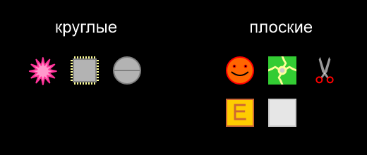

Если **камень** (**электрон**) уже движется, и в направлении движения не пусто,
то происходит столкновение с объектом в направлении движения.
Если объект переживёт столкновение, то **камень** (**электрон**)
останавливается.

### Движение ножниц
**Ножницы** бывают правыми и левыми.

Если справа по направлению движения от **правых ножниц** пусто -
они поворачивают на 90 градусов по часовой стрелке.

Если справа не пусто, то происходит столкновение с объектом справа.
Если объект переживёт столкновение, то **ножницы** пытаются двигаться вперёд.

Если впереди не пусто, то происходит столкновение с объектом впереди.
Если объект переживёт столкновение, то **ножницы** поворачивают на 90 градусов
против часовой стрелки.

Для **левых ножниц** алгоритм аналогичный, но все направления зеркальны.

### Столкновения
При столкновении падающего **камня** или **электрона** с **ножницами** или **героем**
последние взрываются.

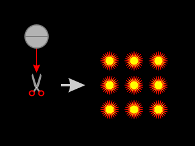

При столкновении с **ножницами** **герой** взрывается.

При столкновении **ножниц** с другими неподвижными объектами нет последствий.

У всех других столкновений нет последствий.

Взрыв занимает 9 клеток.

**Стены** неуязвимы для взрыва.

Другие объекты уничтожаются взрывом.
При этом некоторые взрываются сами, возможна цепная реакция.

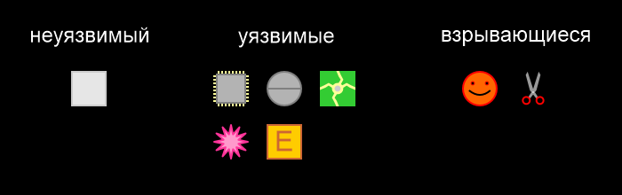

## Пользовательские сценарии

### 1. Запуск игры
При запуске игры игрок видит главное меню:

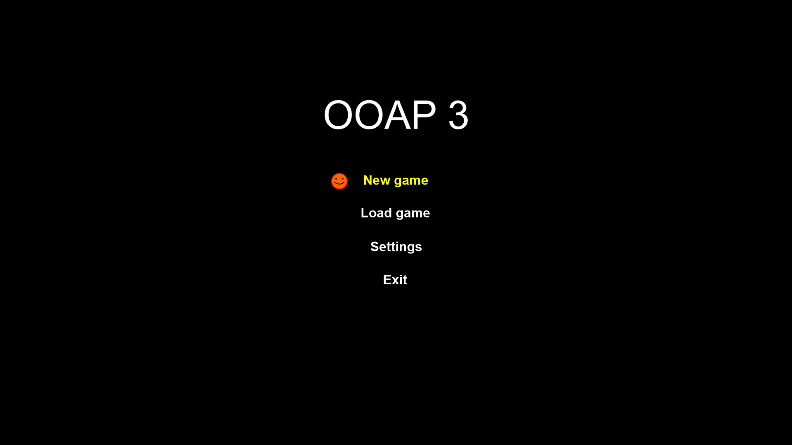

При выборе новой игры появляется меню выбора уровня:

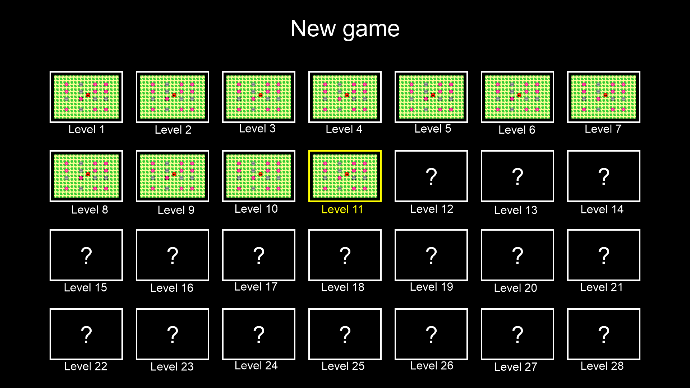

Вначале доступен только первый уровень.

При прохождении очередного уровня открывается следующий.

Информация о том, какие уровни пройдены, сохраняется между запусками игры.

После выбора уровня появляется игровой экран и игра на уровне начинается сначала.

### 2. Сохранение игры
При нажатии определённой клавиши игра ставится на паузу,
и появляется меню сохранения:

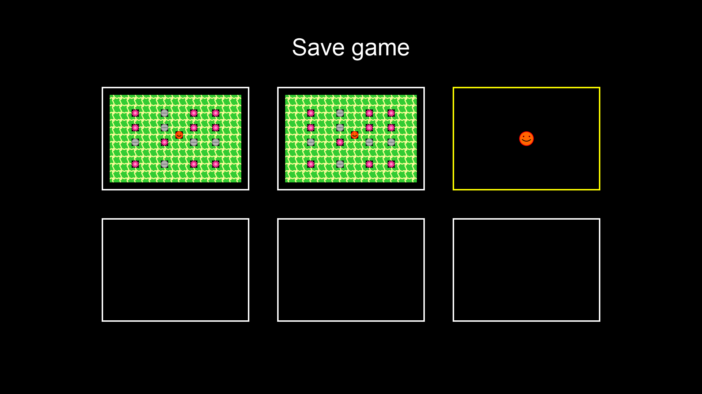

Количество слотов сохранения ограничено.

Можно выбрать свободный, переписать занятый, или отменить сохранение.

После сохранения или его отмены игра продолжается.

### 3. Загрузка игры
При выборе пункта загрузки в главном меню появляется меню загрузки:

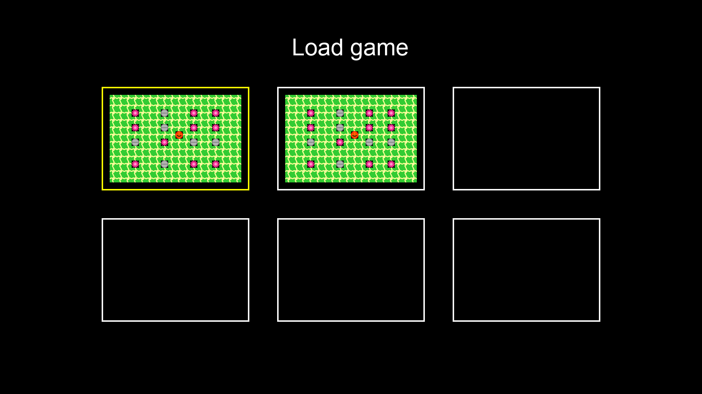

Можно выбрать любую сохранённую игру или отменить загрузку.

При отмене - возвращаемся в главное меню.

При выборе сохранения - появляется игровой экран и игра начинается
с сохранённого состояния.

### 4. Начало игры
Пример игрового экрана. Справа отображается число собранных и требуемых для
завершения уровня электронов.

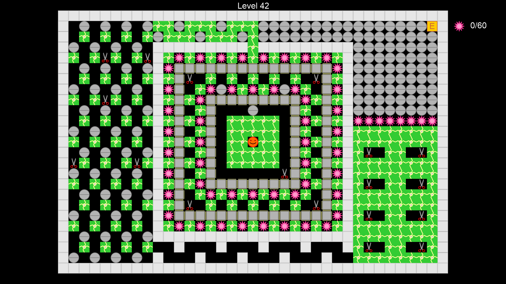

В игре можно управлять героем, перемещая его вверх, вниз, вправо или влево.

Вначале этого уровня герой может устроить ловушку для ножниц, скатив на
них камень у стены из чипов.

Тогда стена будет разрушена и откроется выход во внешнюю комнату.

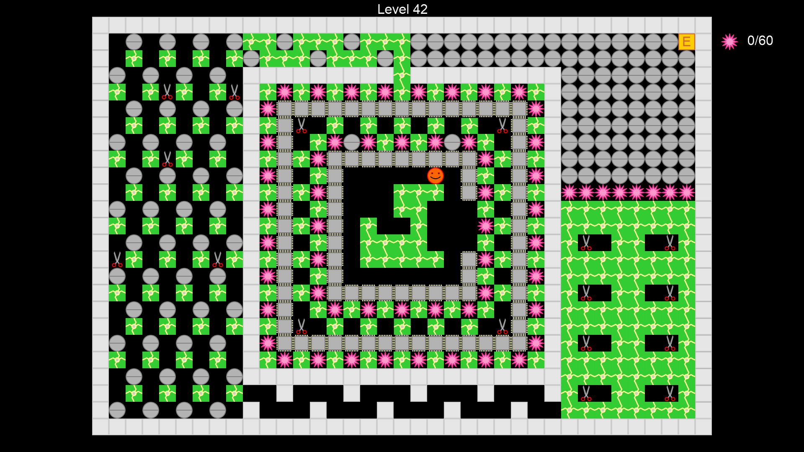

### 5. Второе кольцо

Здесь не стоит сразу есть всё.
Нужно подгадать, чтобы камень был сброшен на ножницы у внешней стены.

Для этого полезно сохранить один из электронов, например, справа.

Левый камень можно использовать, чтобы проредить популяцию ножниц
перед постановкой ловушки.

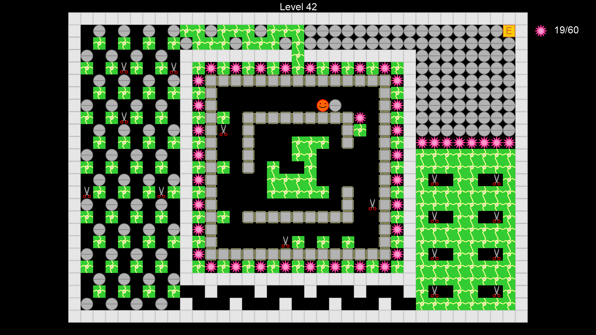

### 6. Оперативный простор

После открытия выхода во внешнее кольцо герой съел электроны
и запер ножницы камнем.

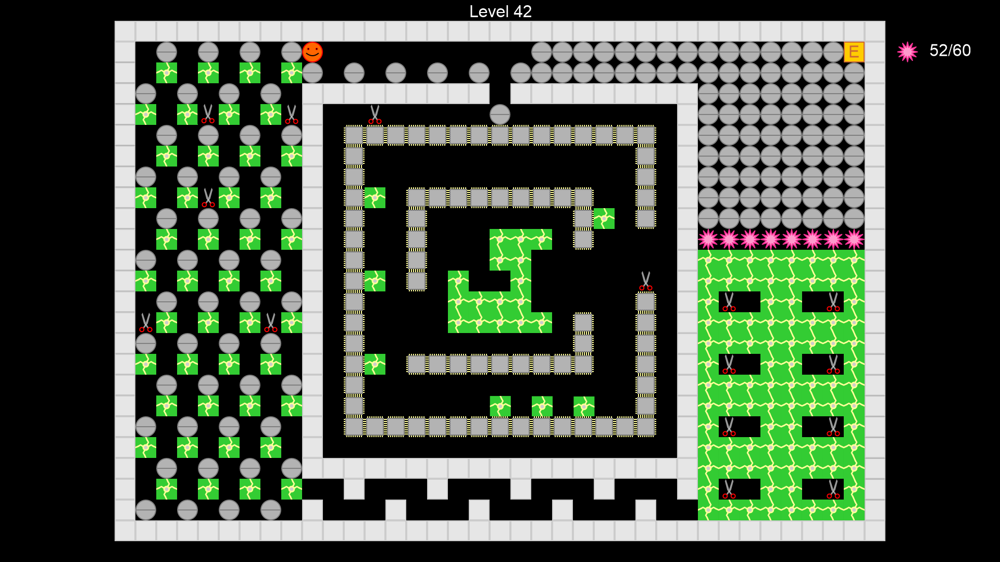

Теперь нужно пробраться вниз, не нарвавшись на ножницы.

Герой двигается, а камни скатываются друг с друга и падают.

С плат камни не скатываются - платы плоские.

Главное - не завалить выход.

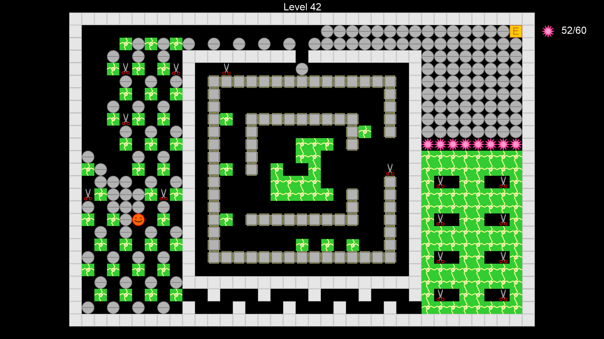

### 7. Обвал

Если камнем не придавило - идём в последнюю комнату.

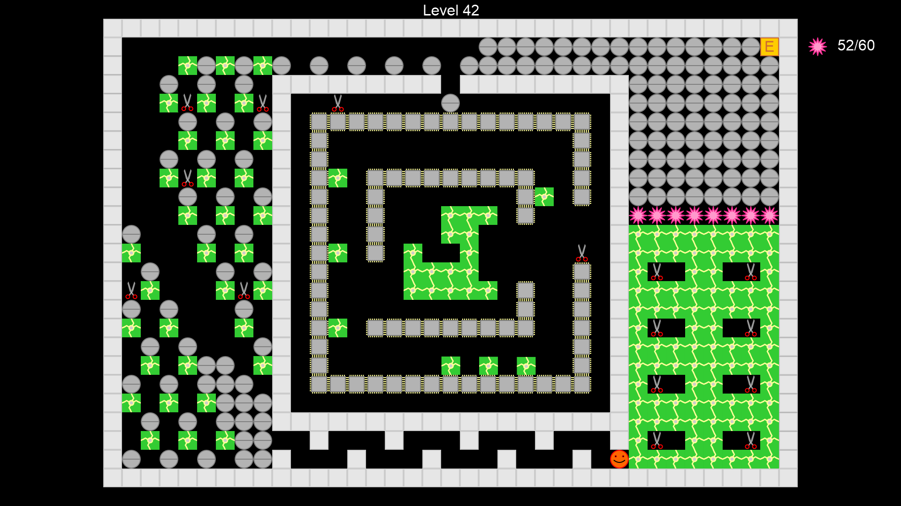

Придётся выпустить их всех, иначе может не хватить места для камней
и выход будет завален.

Если понять, вдоль какой стенки движутся ножницы, можно заставить их зависнуть,
нарезая круги в области 2 на 2 клетки.

Потом можно обрушить сверху камни.

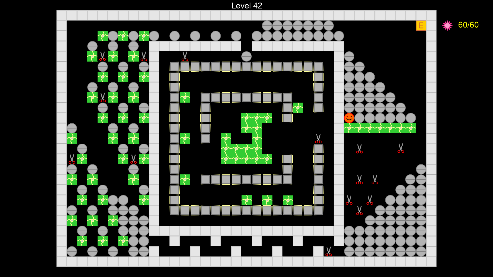

Когда падают нижние камни, под верхними образуется пустота, и они тоже падают.

Внизу камни образуют горку, скатываясь друг с друга.

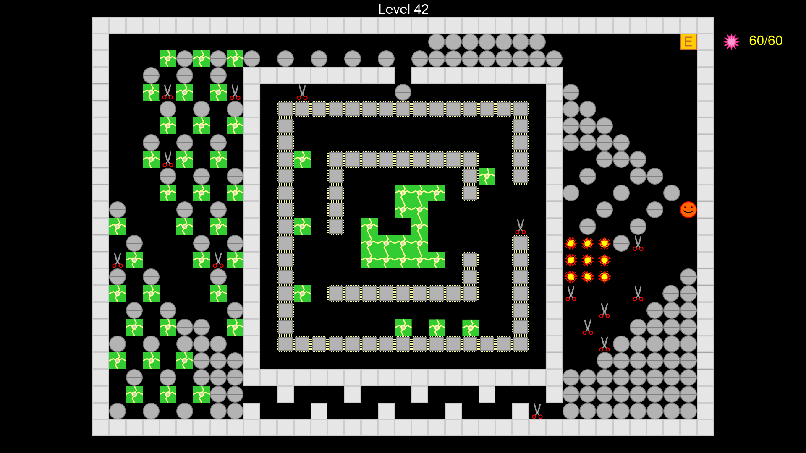
